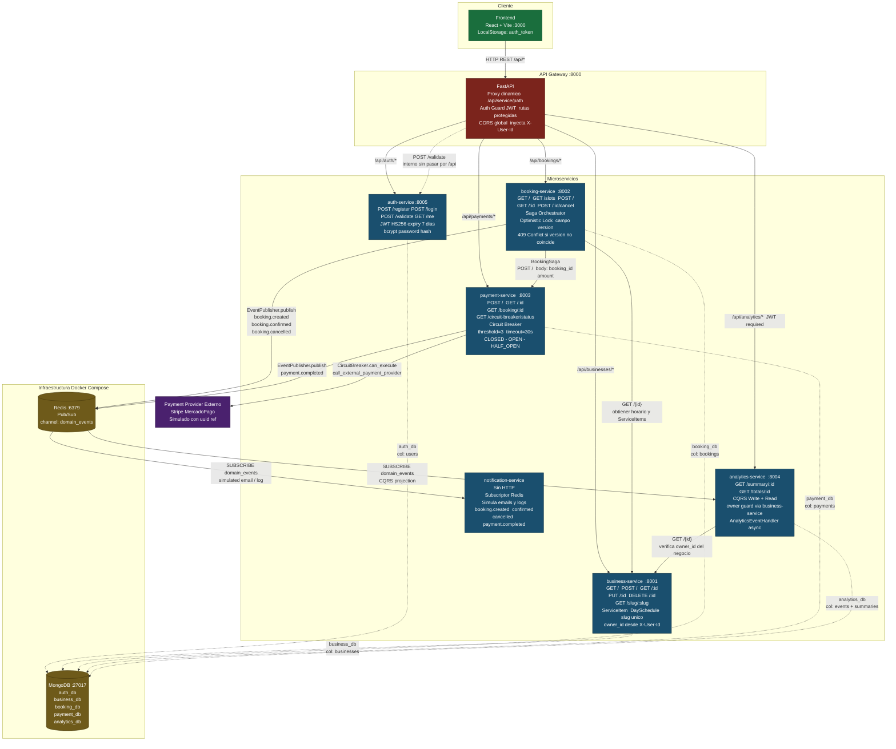
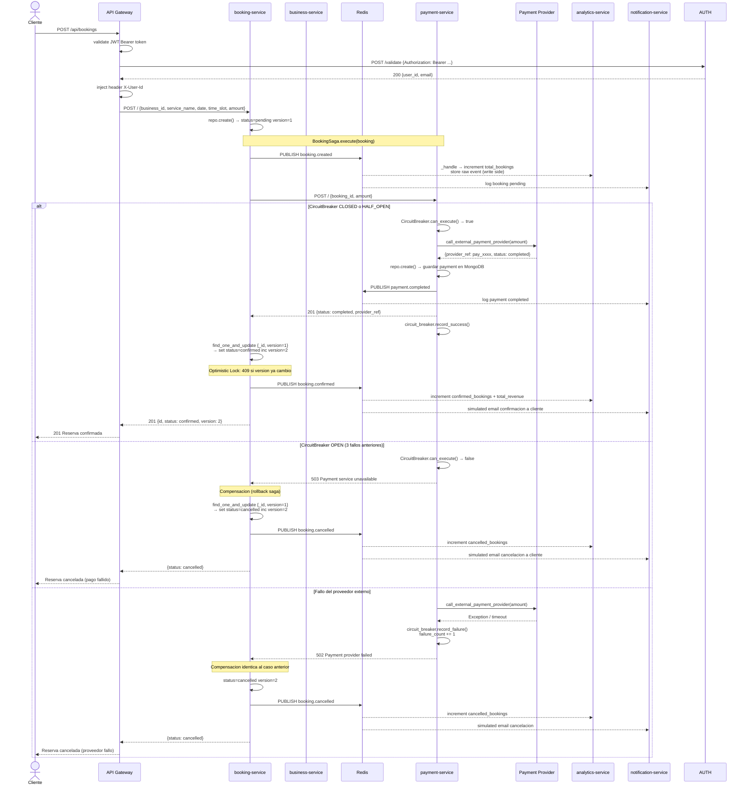
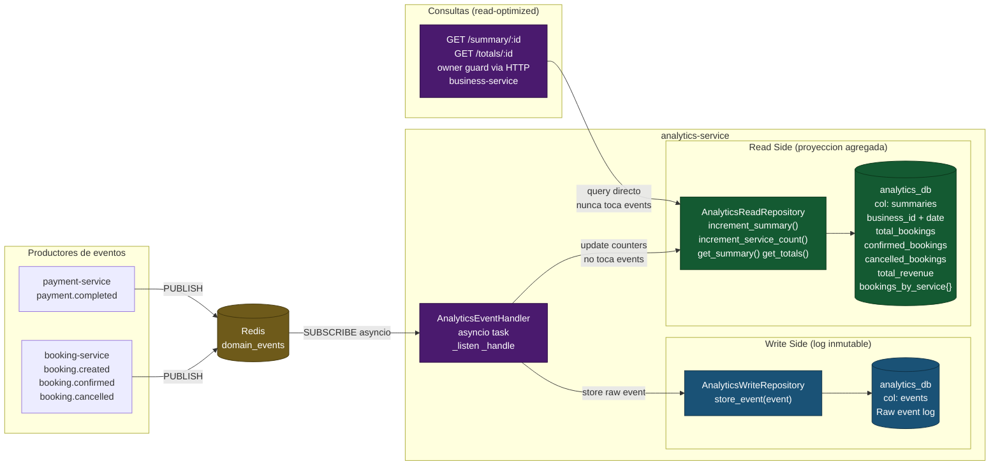
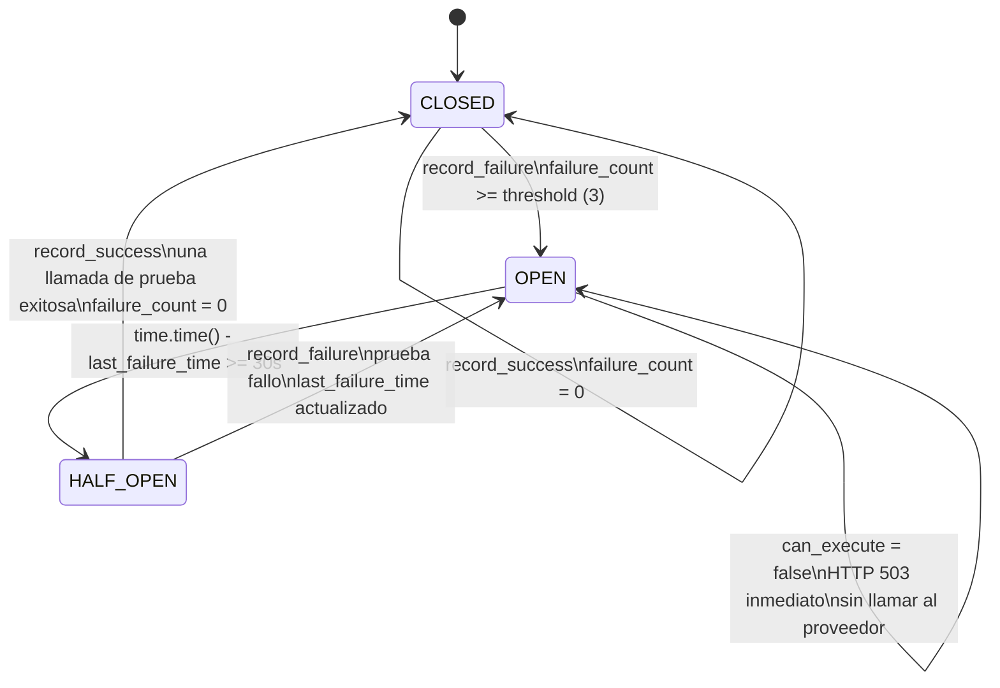

# Entregable 2 - Implementación

---

## Nivel 3 - Componentes

### Controller

Cada servicio expone su lógica HTTP a través de un módulo `controller.py` que contiene un `APIRouter` de FastAPI. El router se monta en `main.py` y se encarga únicamente de recibir requests, delegar al repositorio o a la saga, y devolver respuestas. No contiene lógica de base de datos ni de negocio pesada.

Servicios que implementan el patrón: `business`, `booking`, `payment`, `analytics`, `auth`.

Ejemplo representativo: `services/booking/controller.py` maneja los endpoints `GET /`, `GET /slots`, `POST /`, `GET /{id}`, `POST /{id}/cancel`.

---

### Gestor de inventario con bloqueos optimistas

Implementado en `services/booking/repository.py`, método `update_status_optimistic`.

El mecanismo funciona así: al crear una reserva se le asigna un campo `version: 1`. Cada vez que se quiere cambiar su estado (de `pending` a `confirmed` o `cancelled`) se usa `find_one_and_update` con la condición `{ "_id": id, "version": expected_version }`. Si entre la lectura y la escritura otro proceso ya modificó el documento, la versión no coincide, la operación devuelve `None` y se lanza un `HTTP 409 Conflict`.

Esto evita que dos procesos concurrentes actualicen la misma reserva sin coordinar entre sí, sin necesidad de bloquear filas o colecciones.

```python
# services/booking/repository.py
result = await self.collection.find_one_and_update(
    {"_id": ObjectId(id), "version": expected_version},
    {
        "$set": {"status": new_status, "updated_at": ...},
        "$inc": {"version": 1},
    },
    return_document=True,
)
if not result:
    raise HTTPException(409, "Conflict: booking was modified by another process")
```

---

### Repository pattern

Cada servicio tiene un archivo `repository.py` que encapsula todo el acceso a MongoDB. Los controllers nunca escriben queries directamente; siempre llaman métodos del repositorio (`find_all`, `find_by_id`, `create`, `update`, `delete`). Esto aísla la capa de persistencia y facilita el reemplazo del motor de base de datos sin tocar la lógica de negocio.

Repositorios existentes:
- `services/business/repository.py` - `BusinessRepository`
- `services/booking/repository.py` - `BookingRepository`
- `services/payment/repository.py` - `PaymentRepository`
- `services/analytics/repository.py` - `AnalyticsWriteRepository`, `AnalyticsReadRepository`
- `services/auth/repository.py` - `UserRepository`

---

### Circuit breaker para llamadas externas

Implementado en `services/payment/circuit_breaker.py` y usado en `services/payment/controller.py`.

El circuit breaker maneja tres estados:

- **CLOSED**: funcionamiento normal, las llamadas pasan.
- **OPEN**: se superó el umbral de fallos (`failure_threshold = 3`), las llamadas se bloquean inmediatamente devolviendo `HTTP 503` sin intentar la llamada real.
- **HALF_OPEN**: pasado el tiempo de recuperación (`recovery_timeout = 30s`), se permite una llamada de prueba. Si tiene éxito vuelve a CLOSED; si falla regresa a OPEN.

En el controller, antes de llamar al proveedor de pagos externo se consulta `circuit_breaker.can_execute()`. Si el circuito está abierto, se responde de inmediato sin hacer la llamada. El endpoint `GET /circuit-breaker/status` expone el estado actual para monitoreo.

---

## Patrones arquitectónicos

### Microservicios (mínimo 4 servicios independientes)

El sistema tiene 6 servicios desplegables de forma independiente, cada uno con su propio proceso, Dockerfile y base de datos:

| Servicio | Puerto | Responsabilidad |
|---|---|---|
| `auth-service` | 8005 | Registro, login, validación de tokens JWT |
| `business-service` | 8001 | CRUD de negocios y sus servicios/horarios |
| `booking-service` | 8002 | Reservas, disponibilidad de slots, saga |
| `payment-service` | 8003 | Pagos, circuit breaker contra proveedor externo |
| `analytics-service` | 8004 | Métricas agregadas, consumidor de eventos |
| `notification-service` | - | Notificaciones al cliente vía eventos |

Cada uno se comunica a través de HTTP (sincrónicamente) o Redis pub/sub (asincrónicamente), sin compartir código ni base de datos.

---

### Event-Driven Architecture (eventos de dominio)

Los servicios publican eventos de dominio en un canal de Redis (`domain_events`) usando la clase `EventPublisher` en `services/booking/events.py`. Los suscriptores reciben y reaccionan de forma desacoplada.

Eventos publicados:

| Evento | Publicado por | Consumido por |
|---|---|---|
| `booking.created` | booking-service (saga) | analytics, notification |
| `booking.confirmed` | booking-service (saga) | analytics, notification |
| `booking.cancelled` | booking-service (saga) | analytics, notification |
| `payment.completed` | payment-service | notification |

`analytics-service` y `notification-service` suscriben al canal en su arranque y procesan cada mensaje de forma asíncrona. Ninguno de los dos necesita saber quién publicó el evento ni hace una llamada HTTP directa al servicio de origen.

---

### CQRS (separación lectura/escritura en módulo de analíticas)

El módulo de analíticas tiene dos repositorios con responsabilidades separadas:

**Write side** (`AnalyticsWriteRepository`): recibe cada evento de dominio y lo persiste tal cual en la colección `events`. Esto actúa como el log de eventos.

**Read side** (`AnalyticsReadRepository`): mantiene resúmenes pre-agregados por negocio y fecha en la colección `summaries`. Cuando llega un evento, el handler incrementa los contadores correspondientes (total reservas, confirmadas, canceladas, ingresos). Las queries de lectura nunca tocan la colección de eventos raw; consultan directamente los resúmenes, lo que los hace muy rápidos independientemente del volumen de eventos.

El `AnalyticsEventHandler` en `event_handler.py` actúa como el proyector que transforma los eventos del write side en las vistas del read side.

---

### API Gateway pattern

El servicio `gateway/main.py` es el único punto de entrada para el frontend. Recibe todas las peticiones en `/api/{service}/{path}` y las reenvía al microservicio correspondiente usando `httpx`.

Responsabilidades que centraliza el gateway:
- Enrutamiento hacia los 5 servicios backend
- Validación de tokens JWT para rutas protegidas (llama internamente a `auth-service/validate`)
- Inyección del header `X-User-Id` en los requests downstream una vez autenticado el token
- El frontend nunca conoce las URLs internas de los servicios

Las rutas protegidas son: `POST/PUT/DELETE /api/businesses` y cualquier método en `/api/analytics`.

---

### Database per Service

Cada servicio tiene su propia base de datos MongoDB aislada. Ningún servicio accede a la base de datos de otro:

| Servicio | Base de datos |
|---|---|
| auth-service | `auth_db` |
| business-service | `business_db` |
| booking-service | `booking_db` |
| payment-service | `payment_db` |
| analytics-service | `analytics_db` |

La comunicación entre servicios que necesita datos de otro servicio se hace por HTTP (por ejemplo, booking-service consulta al business-service para obtener el horario al calcular slots disponibles), nunca accediendo directamente a otra base de datos.

---

### Saga pattern para transacciones distribuidas (reserva -> pago)

Implementado en `services/booking/saga.py` como una saga de orquestación. El `BookingSaga` coordina los pasos de la transacción distribuida y maneja las compensaciones en caso de fallo.

Flujo normal:
1. La reserva se crea en estado `pending` (ya persistida antes de llamar la saga).
2. Se publica el evento `booking.created`.
3. Se llama al payment-service por HTTP para procesar el cobro.
4. Si el pago tiene éxito, se actualiza la reserva a `confirmed` usando bloqueo optimista y se publica `booking.confirmed`.

Flujo de compensación (si el pago falla o lanza excepción):
- Se actualiza la reserva a `cancelled` usando bloqueo optimista.
- Se publica `booking.cancelled`.
- El estado queda consistente aunque la transacción no se completó.

El bloqueo optimista dentro de la saga es importante: garantiza que si dos procesos intentan confirmar o cancelar la misma reserva simultáneamente, solo uno lo logrará y el otro recibirá un `409 Conflict`.

---

## Diagramas de arquitectura

### Vista general del sistema



---

### Flujo Saga: Reserva → Pago (camino feliz y compensacion)



---

### CQRS en analytics-service



---

### Circuit Breaker en payment-service


